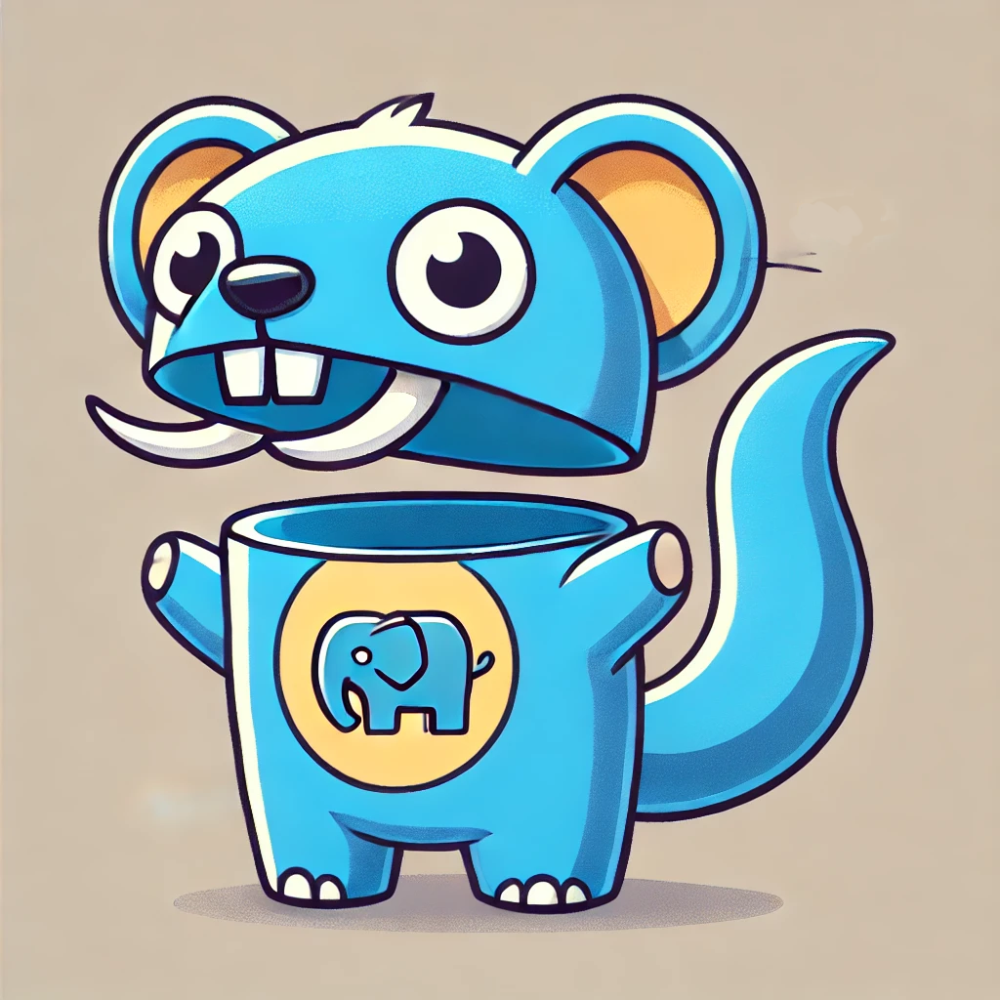

# Frango - Enhanced Virtual Filesystem and Router

This implementation enhances Frango with a powerful Virtual Filesystem (VFS) and Conventional Router for Go and PHP integration.

## Virtual Filesystem Features

The enhanced Virtual Filesystem provides:

- **Multiple Source Types**:
  - Physical filesystem files via `AddSourceFile` and `AddSourceDirectory`
  - Embedded files via `AddEmbeddedFile` and `AddEmbeddedDirectory`
  - Virtual files created at runtime via `CreateVirtualFile`

- **File Operations**:
  - Copy files with `CopyFile`
  - Move files with `MoveFile`
  - Delete files with `DeleteFile`
  - Access file content with `GetFileContent`
  - List all files with `ListFiles`

- **Automatic File Watching**:
  - Watches source files for changes and auto-reloads
  - Uses a centralized mechanism in the middleware
  - Each VFS instance maintains its own file tracking

- **Origin Tracking**:
  - Keeps track of file origins (source, embed, virtual)
  - Prioritizes access based on origin type

## Conventional Router

The Conventional Router combines Go and PHP endpoints:

- **Multiple Route Types**:
  - PHP endpoints via the Virtual Filesystem
  - Go HTTP handlers via `AddGoHandler`
  - Static assets automatically detected and served

- **Routing Conventions**:
  - Clean URLs without `.php` extension
  - Method detection via file extensions (e.g., `users.get.php` → `GET /users`)
  - Index files for directory paths (e.g., `users/index.php` → `/users/`)
  - Parameter extraction from URL paths

- **Configuration Options**:
  - Control URL cleaning, case sensitivity, method detection, etc.
  - Custom parameter pattern syntax
  - Static file extension configuration

## Example Usage

```go
// Create Frango middleware
php, _ := frango.New(frango.WithSourceDir("./web"))
defer php.Shutdown()

// Create virtual filesystem
vfs := php.NewFS()

// Add physical files
vfs.AddSourceDirectory("./web/pages", "/pages")

// Add embedded files
vfs.AddEmbeddedDirectory(embeddedFiles, "templates", "/templates")

// Create virtual files at runtime
vfs.CreateVirtualFile("/config/app.php", []byte(`<?php $config = ['debug' => true]; ?>`))

// Create a conventional router
router := php.NewConventionalRouter(nil)  // Use default options

// Register VFS endpoints
router.RegisterVirtualFSEndpoints(vfs, "/")

// Add pure Go endpoints
router.AddGoHandler("/status", "GET", http.HandlerFunc(func(w http.ResponseWriter, r *http.Request) {
    w.Header().Set("Content-Type", "application/json")
    w.Write([]byte(`{"status":"ok"}`))
}))

// Start the server
http.ListenAndServe(":8080", router.Handler())
```

## Benefits

1. **Simplified Development**: Easily combine PHP and Go within the same application
2. **Flexible Content Sources**: Mix physical files, embedded resources, and dynamic content
3. **Convention over Configuration**: Define routes based on filesystem structure
4. **Developer Experience**: Auto-reload on file changes for fast development cycle
5. **Production Ready**: Embedded files for single binary deployment

## Running the Example

```bash
# Navigate to the example directory
cd examples/virtual_fs

# Run the example
go run main.go

# Visit http://localhost:8080 in your browser
```

## Frango - PHP Middleware for Go

Frango is a focused, framework-agnostic middleware that integrates PHP into any Go HTTP server using [FrankenPHP](https://github.com/dunglas/frankenphp).

<p align="center">
  
</p>

> IT IS STILL WORK IN PROGRESS

## Design Philosophy

Frango is built as a **pure middleware** with no server abstractions. This design:

1. **Maximizes compatibility** - Works with any HTTP server or router
2. **Minimizes dependencies** - No external dependencies beyond FrankenPHP
3. **Simplifies integration** - Drop-in middleware pattern fits Go's standard idioms
4. **Enables flexibility** - Stack PHP processing with other middleware in any order

## Features

- **Pure middleware implementation** - Implements http.Handler for maximum compatibility
- **Framework adapters** - Specialized adapters for popular frameworks (Chi, Gin, Echo)
- **Development mode** - Automatic PHP file change detection during development
- **Path-based routing** - Map URLs to PHP files with fine-grained control
- **Directory mounting** - Serve entire directories of PHP files with one call
- **Embedded support** - Embed PHP files directly in your Go binary

## ⚠️ IMPORTANT: Prerequisites

Before you begin, make sure you have all the prerequisites below. **The library will not work without properly built PHP.**

- Go 1.21 or later
- PHP 8.2 or later **built with specific flags** (see Building PHP section)
- Required PHP extensions:
  - Redis extension (`pecl install redis`)
  - cURL extension
- GCC and other build tools for compiling FrankenPHP

### Building PHP for FrankenPHP on macOS

FrankenPHP requires PHP to be built as a static library with ZTS (thread safety) enabled. The standard PHP installation from Homebrew won't work.

1. Install required dependencies:
```bash
brew install libiconv bison brotli re2c pkg-config
echo 'export PATH="/opt/homebrew/opt/bison/bin:$PATH"' >> ~/.zshrc
source ~/.zshrc  # Reload shell configuration
```

2. Get PHP source and configure it:
```bash
# Get PHP source
cd ~ && mkdir -p php-build && cd php-build
curl -LO https://www.php.net/distributions/php-8.2.20.tar.gz
tar -xzf php-8.2.20.tar.gz
cd php-8.2.20

# Configure with the correct flags for macOS
# Note: We're explicitly configuring with minimal extensions to avoid dependency issues
./configure \
    --enable-embed=static \
    --enable-zts \
    --disable-zend-signals \
    --disable-opcache-jit \
    --enable-static \
    --enable-shared=no \
    --with-iconv=/opt/homebrew/opt/libiconv/ \
    --without-sqlite3 \
    --without-pdo-sqlite \
    --disable-dom \
    --disable-xml \
    --disable-simplexml \
    --disable-xmlreader \
    --disable-xmlwriter \
    --disable-libxml
```

3. Compile and install PHP:
```bash
make -j"$(getconf _NPROCESSORS_ONLN)"
sudo make install
```

4. Verify the PHP build:
```bash
# Check that the static library was created
ls -la /usr/local/lib/libphp.a

# Check php-config output
php-config --includes
php-config --ldflags
php-config --libs

# The output should include paths to the PHP header files and libraries
```

### Alternative: Building PHP with Official FrankenPHP Method

If the above method doesn't work, try using the exact method from the FrankenPHP repository:

1. Clone the FrankenPHP repository and build PHP from there:
```bash
# Clone the repository
git clone https://github.com/dunglas/frankenphp.git
cd frankenphp

# Build PHP using the provided script (this will handle everything for you)
./install.sh

# The script will download, configure and compile PHP with the correct flags
```

### Running the Application

1. Install Go dependencies:
```bash
go mod tidy
```

2. Run the application with the correct CGO flags:
```bash
# Method 1: Using php-config
CGO_CFLAGS=$(php-config --includes) CGO_LDFLAGS="$(php-config --ldflags) $(php-config --libs)" go run -tags=nowatcher ./examples/basic

# Method 2: Explicitly setting the paths (try this if Method 1 fails)
CGO_CFLAGS="-I/usr/local/include/php -I/usr/local/include/php/main -I/usr/local/include/php/Zend -I/usr/local/include/php/TSRM -I/usr/local/include/php/ext" CGO_LDFLAGS="-L/usr/local/lib -lphp" go run -tags=nowatcher ./examples/basic
```

## Important Notes About FrankenPHP

Before using this library, be aware of these FrankenPHP characteristics:

- It doesn't provide a built-in global memory store that persists across multiple PHP requests and workers.
- It runs PHP scripts using Caddy and a worker pool model, which means:
  - Each request is processed independently.
  - PHP memory resets after each request (just like traditional FPM).
  - There is no global memory space shared between requests by default.

## Installation

```bash
go get github.com/davidroman0O/frango
```

## Quick Start

```go
package main

import (
    "log"
    "net/http"
    
    "github.com/davidroman0O/frango"
)

func main() {
    // Create the PHP middleware
    php, err := frango.New(
        frango.WithSourceDir("./web"),
        frango.WithDevelopmentMode(true),
    )
    if err != nil {
        log.Fatalf("Error creating PHP middleware: %v", err)
    }
    defer php.Shutdown()
    
    // Register PHP endpoints
    php.HandlePHP("/api/users", "api/users.php")
    php.HandleDir("/pages", "pages")
    
    // Create standard HTTP mux
    mux := http.NewServeMux()
    
    // Add Go handlers
    mux.HandleFunc("/api/time", timeHandler)
    
    // Use PHP middleware for /api paths
    mux.Handle("/api/", php.Wrap(http.NotFoundHandler()))
    
    // Mount PHP directly for a dedicated path
    mux.Handle("/php/", http.StripPrefix("/php", php))
    
    // Start the server
    log.Println("Server starting on :8080")
    http.ListenAndServe(":8080", mux)
}
```

## Integration Patterns

### Standard net/http

```go
// Basic usage as middleware
mux := http.NewServeMux()
mux.Handle("/api/", php.Wrap(apiHandler))

// Direct mounting
mux.Handle("/php/", http.StripPrefix("/php", php))

http.ListenAndServe(":8080", mux)
```

### Separate PHP and Go Routes

For complex applications, you may want to clearly separate PHP and Go routes:

```go
// Create a router for Go API endpoints
apiMux := http.NewServeMux()
apiMux.HandleFunc("GET /api/status", statusHandler)

// Create a router for PHP pages
phpMux := http.NewServeMux()
phpMux.HandleFunc("/", func(w http.ResponseWriter, r *http.Request) {
    php.ServeHTTP(w, r)
})

// Register PHP files
php.HandlePHP("/", "index.php")
php.HandlePHP("/users", "users.php")

// Create a parent router
rootMux := http.NewServeMux()
rootMux.Handle("/api/", apiMux)
rootMux.Handle("/", phpMux)

http.ListenAndServe(":8080", rootMux)
```

### Chi Router

```go
r := chi.NewRouter()

// Mount at a specific path
r.Mount("/php", php)

// As middleware in a group
r.Group(func(r chi.Router) {
    r.Use(php.ForChi())
    r.Get("/api/*", yourHandler)
})

http.ListenAndServe(":8080", r)
```

### Gin

```go
g := gin.New()

// Use middleware on specific routes
apiGroup := g.Group("/api")
apiGroup.Use(func(c *gin.Context) {
    req := c.Request
    if php.ShouldHandlePHP(req) {
        php.ServeHTTP(c.Writer, req)
        c.Abort()
        return
    }
    c.Next()
})

g.Run(":8080")
```

### Echo

```go
e := echo.New()

// Use the built-in adapter
e.Use(php.ForEcho())

e.Start(":8080")
```

## Key Methods

- `New(options...)` - Create a new middleware instance
- `HandlePHP(pattern, phpFile)` - Register a PHP file at a URL path
- `HandleDir(prefix, dirPath)` - Register all PHP files in a directory
- `AddFromEmbed(urlPath, fs, fsPath)` - Add a PHP file from embed.FS
- `Wrap(next http.Handler)` - Wrap another handler (middleware pattern)
- `ServeHTTP(w, r)` - Implements http.Handler interface
- `ShouldHandlePHP(r *http.Request)` - Checks if a request should be handled by PHP

## Configuration Options

```go
php, err := frango.New(
    frango.WithSourceDir("./web"),       // Source directory for PHP files
    frango.WithDevelopmentMode(true),    // Enable development mode
    frango.WithLogger(customLogger),     // Custom logger
)
```

## Data Injection

You can inject Go variables into PHP templates:

```go
// Register a PHP file with dynamic data
php.HandleRender("/dashboard", "dashboard.php", func(w http.ResponseWriter, r *http.Request) map[string]interface{} {
    return map[string]interface{}{
        "title": "Dashboard",
        "user": map[string]interface{}{
            "name": "John Doe",
            "role": "Admin",
        },
    }
})
```

In PHP, access these variables:

```php
<?php
$title = go_var('title', 'Default Title');
$user = go_var('user', []);

echo "<h1>$title</h1>";
echo "<p>Welcome, {$user['name']}!</p>";
?>
```

## License

MIT

## Contributing

Contributions are welcome! Please feel free to submit a Pull Request. 