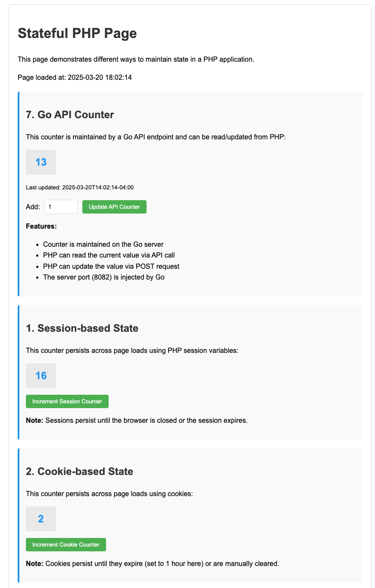

# Go-PHP TODO Application

Yes it's working-ish




### Prerequisites
- Go 1.21 or later
- PHP 8.2 or later **built with specific flags** (see Building PHP section)
- Required PHP extensions:
  - Redis extension (`pecl install redis`)
  - cURL extension
- GCC and other build tools for compiling FrankenPHP

### Building PHP for FrankenPHP on macOS

FrankenPHP requires PHP to be built as a static library with ZTS (thread safety) enabled. The standard PHP installation from Homebrew won't work.

1. Install required dependencies:
```bash
brew install libiconv bison brotli re2c pkg-config
echo 'export PATH="/opt/homebrew/opt/bison/bin:$PATH"' >> ~/.zshrc
source ~/.zshrc  # Reload shell configuration
```

2. Get PHP source and configure it:
```bash
# Get PHP source
cd ~ && mkdir -p php-build && cd php-build
curl -LO https://www.php.net/distributions/php-8.2.20.tar.gz
tar -xzf php-8.2.20.tar.gz
cd php-8.2.20

# Configure with the correct flags for macOS
# Note: We're explicitly configuring with minimal extensions to avoid dependency issues
./configure \
    --enable-embed=static \
    --enable-zts \
    --disable-zend-signals \
    --disable-opcache-jit \
    --enable-static \
    --enable-shared=no \
    --with-iconv=/opt/homebrew/opt/libiconv/ \
    --without-sqlite3 \
    --without-pdo-sqlite \
    --disable-dom \
    --disable-xml \
    --disable-simplexml \
    --disable-xmlreader \
    --disable-xmlwriter \
    --disable-libxml
```

3. Compile and install PHP:
```bash
make -j"$(getconf _NPROCESSORS_ONLN)"
sudo make install
```

4. Verify the PHP build:
```bash
# Check that the static library was created
ls -la /usr/local/lib/libphp.a

# Check php-config output
php-config --includes
php-config --ldflags
php-config --libs

# The output should include paths to the PHP header files and libraries
```

### Alternative: Building PHP with Official FrankenPHP Method

If the above method doesn't work, try using the exact method from the FrankenPHP repository:

1. Clone the FrankenPHP repository and build PHP from there:
```bash
# Clone the repository
git clone https://github.com/dunglas/frankenphp.git
cd frankenphp

# Build PHP using the provided script (this will handle everything for you)
./install.sh

# The script will download, configure and compile PHP with the correct flags
```

### Running the Application

1. Install Go dependencies:
```bash
go mod tidy
```

2. Run the application with the correct CGO flags:
```bash
# Method 1: Using php-config
CGO_CFLAGS=$(php-config --includes) CGO_LDFLAGS="$(php-config --ldflags) $(php-config --libs)" go run -tags=nowatcher ./playground/hello/main.go

# Method 2: Explicitly setting the paths (try this if Method 1 fails)
CGO_CFLAGS="-I/usr/local/include/php -I/usr/local/include/php/main -I/usr/local/include/php/Zend -I/usr/local/include/php/TSRM -I/usr/local/include/php/ext" CGO_LDFLAGS="-L/usr/local/lib -lphp" go run -tags=nowatcher ./playground/hello/main.go
```

## Troubleshooting

### Common errors

1. **Missing header errors**
   - For `fatal error: 'wtr/watcher-c.h' file not found`: Use the `-tags=nowatcher` flag when building or running
   - For `fatal error: 'php_variables.h' file not found`: PHP development headers are missing or not in the include path

2. **Undefined symbols errors**
   ```
   Undefined symbols for architecture arm64:
     "_compiler_globals", referenced from:...
   ```
   This indicates that PHP wasn't built correctly. Solutions include:
   
   a) Make sure PHP is built with exactly these flags:
   ```
   --enable-embed=static --enable-zts --disable-zend-signals --disable-opcache-jit --enable-static --enable-shared=no
   ```
   
   b) Use the install.sh script from the FrankenPHP repository:
   ```
   git clone https://github.com/dunglas/frankenphp.git
   cd frankenphp
   ./install.sh
   ```
   
   c) Try building FrankenPHP as a standalone binary instead of embedding it:
   ```
   git clone https://github.com/dunglas/frankenphp.git
   cd frankenphp
   make
   ```

3. **Simplest alternative approach**
   Instead of trying to embed FrankenPHP in your Go application, consider:
   
   a) Using FrankenPHP as a standalone server:
   ```bash
   # Install FrankenPHP with Homebrew
   brew install dunglas/frankenphp/frankenphp
   
   # Run FrankenPHP with your PHP files
   frankenphp run --config Caddyfile
   
   # In a separate terminal, run your Go API server
   go run api/main.go
   ```
   
   b) Use separate PHP-FPM and Go servers with a reverse proxy in front

4. **PHP extension errors**
   Make sure the required PHP extensions are installed:
   ```bash
   pecl install redis
   ```

## Resources

For more information on compiling FrankenPHP, see the [official documentation](https://github.com/dunglas/frankenphp/blob/main/docs/compile.md).

## License

MIT 